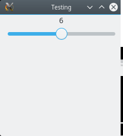

# A first example: GUI controls

Let's create a `slider` object:
```jldoctest demo1
julia> using Gtk.ShortNames, GtkReactive

julia> sl = slider(1:11)
Gtk.GtkScaleLeaf with Signal{Int64}(6, nactions=1)

julia> typeof(sl)
GtkReactive.Slider{Int64}
```

A `GtkReactive.Slider` holds two important objects: a `Signal`
(encoding the "state" of the widget) and a `GtkWidget` (which controls
the on-screen display). We can extract both of these components:

```jldoctest demo1
julia> signal(sl)
Signal{Int64}(6, nactions=1)

julia> typeof(widget(sl))
Gtk.GtkScaleLeaf
```
(If you omitted the `typeof`, you'd instead see a long display that encodes the settings of the `GtkScaleLeaf` widget.)

At present, this slider is not affiliated with any window. Let's
create one and add the slider to the window. We'll put it inside a
`Box` so that we can later add more things to this GUI:

```jldoctest demo1
julia> win = Window("Testing") |> (bx = Box(:v));  # a window containing a vertical Box for layout

julia> push!(bx, sl);    # put the slider in the box, shorthand for push!(bx, widget(sl));

julia> showall(win);
```

Because of the `showall`, you should now see a window with your slider
in it:



The value should be 6, set to the median of the range `1:11`
that we used to create `sl`. Now drag the slider all the way to the
right, and then see what happened to `sl`:

```@meta
push!(sl, 11)
Reactive.run_till_now()
sleep(1)
Reactive.run_till_now()
```

```jldoctest demo1
julia> sl
Gtk.GtkScaleLeaf with Signal{Int64}(11, nactions=1)
```

You can see that dragging the slider caused the value of the signal to
update. Let's do the converse, and set the value of the slider
programmatically:

```jldoctest demo1
julia> push!(sl, 1)  # shorthand for push!(signal(sl), 1)
```

Now if you check the window, you'll see that the slider is at 1.

Realistic GUIs may have many different widgets. Let's add a second way
to adjust the value of that signal, by allowing the user to type a
value into a textbox:

```jldoctest demo1
julia> tb = textbox(Int; signal=signal(sl))
Gtk.GtkEntryLeaf with Signal{Int64}(1, nactions=2)

julia> push!(bx, tb);

julia> showall(win);
```


Here we created the textbox in a way that shared the signal of `sl`
with the textbox; consequently, the textbox updates when you move the
slider, and the slider moves when you enter a new value into the
textbox. `push!`ing a value to `signal(sl)` updates both.
