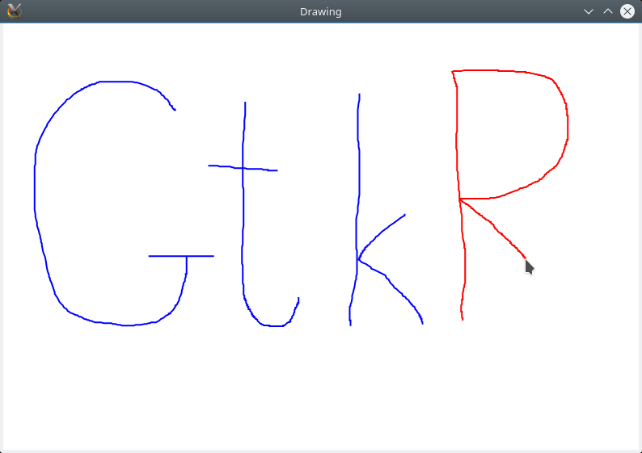

# A simple drawing program

Aside from widgets, GtkReactive also adds canvas interactions,
specifically handling of mouse clicks and scroll events. We can
explore some of these tools by building a simple program for drawing
lines.

Let's begin by creating a window with a canvas in it:

```julia
using Gtk.ShortNames, GtkReactive, Graphics, Colors

win = Window("Drawing")
c = canvas(UserUnit)       # create a canvas with user-specified coordinates
push!(win, c)
```

Here we specified [`UserUnit`](@ref) units for our drawing and
mouse-position units; the default is [`DeviceUnit`](@ref),
a.k.a. pixels.  Here we prefer to specify our own units, which here
we'll choose to be (0,0) for the top left and (1,1) for the bottom
right. With this choice, if a user resizes the window by dragging its
border, our lines will stay in the same relative position.

We're going to set this up so that a new line is started when the user
clicks with the left mouse button; when the user releases the mouse
button, the line is finished and added to a list of previously-drawn
lines. Consequently, we need a place to store user data. We'll use
Signals, so that our Canvas will be notified when there is new
material to draw:

```julia
const lines = Signal([])   # the list of lines that we'll draw
const newline = Signal([]) # the in-progress line (will be added to list above)
```

Now, let's make our application respond to mouse-clicks:

```julia
const drawing = Signal(false)  # this will become true if we're actively dragging

sigstart = map(c.mouse.buttonpress) do btn
    if btn.button == 1 && btn.modifiers == 0
        push!(drawing, true)   # start extending the line
        push!(newline, [btn.position])
    end
end
```

`sigstart` is also a signal; we won't do anything with it, but we
assigned it to a variable to prevent it from being
garbage-collected. (We could use `GtkReactive.gc_preserve(win,
sigstart)` if we wanted to keep it alive for at least as long as `win`
is active.)

Once the user clicks the button, `drawing` holds value `true`; from
that point forward, any movement of the mouse extends the line by an
additional vertex:

```julia
const dummybutton = MouseButton{UserUnit}()
sigextend = map(filterwhen(drawing, dummybutton, c.mouse.motion)) do btn
    push!(newline, push!(value(newline), btn.position))
end
```

Notice that we made this conditional on `drawing` by using
`filterwhen`; `dummybutton` is just a default value of the same type
as `c.mouse.motion` to provide for `filterwhen`.

Finally, when the user releases the mouse button, we stop drawing, store
`newline` in `lines`, and prepare for the next line by starting with
an empty `newline`:

```julia
sigend = map(c.mouse.buttonrelease) do btn
    if btn.button == 1
        push!(drawing, false)  # stop extending the line
        push!(lines, push!(value(lines), value(newline)))
        push!(newline, [])
    end
end
```

At this point, you could already verify that these interactions work
by monitoring `lines` from the command line by clicking, dragging, and
releasing.

However, it's much more fun to see it in action. Let's set up a `draw`
method for the canvas, one that gets called (1) whenever the window
resizes, or (2) whenever `lines` or `newline` update:

```julia
redraw = draw(c, lines, newline) do cnvs, lns, newl
    fill!(cnvs, colorant"white")   # background is white
    set_coords(cnvs, BoundingBox(0, 1, 0, 1))  # set coordinates to 0..1 along each axis
    ctx = getgc(cnvs)
    for l in lns
        drawline(ctx, l, colorant"blue")  # draw old lines in blue
    end
    drawline(ctx, newl, colorant"red")    # draw new line in red
end

function drawline(ctx, l, color)
    isempty(l) && return
    p = first(l)
    move_to(ctx, p.x, p.y)
    set_source(ctx, color)
    for i = 2:length(l)
        p = l[i]
        line_to(ctx, p.x, p.y)
    end
    stroke(ctx)
end
```

A lot of these commands come from Cairo.jl and/or Graphics.jl.

Our application is done! (But don't forget to `showall(win)`.) Here's a
picture of me in the middle of a very fancy drawing:



You can play with the completed application in the `examples/` folder.
