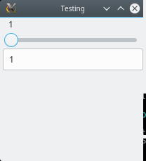

# Introduction

## Scope of this package

GtkReactive is a package building on the functionality of
[Gtk.jl](https://github.com/JuliaGraphics/Gtk.jl) and
[Reactive.jl](https://github.com/JuliaGizmos/Reactive.jl). Its main
purpose is to simplify the handling of interactions among components
of a graphical user interface (GUI).

Creating a GUI generally involves some or all of the following:

1. creating the controls
2. arranging the controls (layout) in one or more windows
3. specifying the interactions among components of the GUI
4. (for graphical applications) canvas drawing
5. (for graphical applicaitons) canvas interaction (mouse clicks, drags, etc.)

GtkReactive is targeted primarily at items 1, 3, and 5. Layout is
handled by Gtk.jl, and drawing (with a couple of exceptions) is
handled by plotting packages or at a lower level by
[Cairo](https://github.com/JuliaGraphics/Cairo.jl).

GtkReactive is suitable for:

- "quick and dirty" applications which you might create from the command line
- more sophisticated GUIs where layout is specified using tools like [Glade](https://glade.gnome.org/)

For usage with Glade, the [Input widgets](@ref) and
[Output widgets](@ref) defined by this package allow you to supply a
pre-existing `widget` (which you might load with GtkBuilder) rather
than creating one from scratch. Users interested in using GtkReactive
with Glade are encouraged to see how the [`player`](@ref) widget is
constructed (see `src/extrawidgets.jl`).

At present, GtkReactive supports only a small subset of the
[widgets provided by Gtk](https://developer.gnome.org/gtk3/stable/ch03.html). It
is fairly straightforward to add new ones, and pull requests would be
welcome.

## Concepts

The central concept of Reactive.jl is the `Signal`, a type that allows
updating with new values that then triggers actions that may update
other `Signal`s or execute functions. Your GUI ends up being
represented as a "graph" of Signals that collectively propagate the
state of your GUI. GtkReactive couples `Signal`s to Gtk.jl's
widgets. In essense, Reactive.jl allows ordinary Julia objects to
become the triggers for callback actions; the primary advantage of
using Julia objects, rather than Gtk widgets, as the "application
logic" triggers is that it simplifies reasoning about the GUI and
seems to reduce the number of times ones needs to consult the
[Gtk documentation](https://developer.gnome.org/gtk3/stable/gtkobjects.html).

It's worth emphasizing two core Reactive.jl features:

- updates to `Signal`s are asynchronous, so values will not propagate
  until the next time the Reactive message-handler runs

- derived signals are subject to garbage-collection; you should either
  hold a reference to or `preserve` any derived signals

Please see the [Reactive.jl documentation](http://juliagizmos.github.io/Reactive.jl/) for more information.

## A first example

Let's create a `slider` object:
```jldoctest demo1
julia> using Gtk.ShortNames, GtkReactive

julia> sl = slider(1:11)
Gtk.GtkScaleLeaf with Signal{Int64}(6, nactions=1)

julia> typeof(sl)
GtkReactive.Slider{Int64}
```

A `GtkReactive.Slider` holds two important objects: a `Signal`
(encoding the "state" of the widget) and a `GtkWidget` (which controls
the on-screen display). We can extract both of these components:

```jldoctest demo1
julia> signal(sl)
Signal{Int64}(6, nactions=1)

julia> typeof(widget(sl))
Gtk.GtkScaleLeaf
```
(If you omitted the `typeof`, you'd instead see a long display that encodes the settings of the `GtkScaleLeaf` widget.)

At present, this slider is not affiliated with any window. Let's
create one and add the slider to the window. We'll put it inside a
`Box` so that we can later add more things to this GUI:

```jldoctest demo1
julia> win = Window("Testing") |> (bx = Box(:v));  # a window containing a vertical Box for layout

julia> push!(bx, sl);    # put the slider in the box; shorthand for push!(bx, widget(sl))

julia> showall(win);
```

Because of the `showall`, you should now see a window with your slider
in it:


The value should be 6, set to the median of the range `1:11`
that we used to create `sl`. Now drag the slider all the way to the
right, and then see what happened to `sl`:

```@meta
push!(sl, 11)
Reactive.run_till_now()
sleep(1)
Reactive.run_till_now()
```

```jldoctest demo1
julia> sl
Gtk.GtkScaleLeaf with Signal{Int64}(11, nactions=1)
```

You can see that dragging the slider caused the value of the signal to
update. Let's do the converse, and set the value of the slider
programmatically:

```jldoctest demo1
julia> push!(sl, 1)  # shorthand for push!(signal(sl), 1)
```

Now if you check the window, you'll see that the slider is at 1.

Realistic GUIs may have many different widgets. Let's add a second way
to adjust the value of that signal, by allowing the user to type a
value into a textbox:

```jldoctest demo1
julia> tb = textbox(Int; signal=signal(sl))
Gtk.GtkEntryLeaf with Signal{Int64}(1, nactions=2)

julia> push!(bx, tb);

julia> showall(win);
```



Here we created the textbox in a way that shared the signal of `sl`
with the textbox; consequently, the textbox updates when you move the
slider, and the slider moves when you enter a new value into the
textbox. `push!`ing a value to `signal(sl)` updates both.

## Drawing and canvas interaction

Aside from widgets, GtkReactive also adds canvas interactions,
specifically handling of mouse clicks and scroll events. It also
provides high-level functions to make it easier implement
rubber-banding, pan, and zoom functionality.

To illustrate these tools, let's first open a window with a drawing canvas:

```jldoctest demo2
julia> using Gtk.ShortNames, GtkReactive, TestImages

julia> win = Window("Image");

julia> c = canvas(UserUnit);

julia> push!(win, c);
```

The `UserUnit` specifies that mouse pointer positions will be reported
in the units we specify, through a `set_coords` call illustrated
later.

Now let's load an image to draw into the canvas:
```jldoctest demo2
julia> image = testimage("lighthouse");
```

For what follows, it may be worth reminding readers that julia arrays
are indexed as `image[row, column]`, whereas for graphics we usually
think in terms of `(x, y)`. Since `x` corresponds to `column` and `y`
corresponds to `row`, some operations will require that we swap the
first and second indices.

Zoom and pan interactions all work through a [`ZoomRegion`](@ref) signal; let's
create one for this image:
```jldoctest demo2
julia> zr = Signal(ZoomRegion(image))
Signal{GtkReactive.ZoomRegion{RoundingIntegers.RInt64}}(GtkReactive.ZoomRegion{RoundingIntegers.RInt64}(GtkReactive.XY{IntervalSets.ClosedInterval{RoundingIntegers.RInt64}}(1..768,1..512),GtkReactive.XY{IntervalSets.ClosedInterval{RoundingIntegers.RInt64}}(1..768,1..512)), nactions=0)
```

The key thing to note here is that it has been created for the
intervals `1..768` (corresponding to the width of the image) and
`1..512` (the height of the image). Let's now create a `view` of the image as a Signal:

```jldoctest demo2
julia> imgsig = map(zr) do r
           cv = r.currentview   # extract the currently-selected region
           view(image, UnitRange{Int}(cv.y), UnitRange{Int}(cv.x))
       end;
```

`imgsig` will update any time `zr` is modified. We then define a
`draw` method for the canvas that paints this selection to the canvas:

```jldoctest demo2
julia> redraw = draw(c, imgsig, zr) do cnvs, img, r
           copy!(cnvs, img)
           set_coords(cnvs, r)  # set the canvas coordinates to the selected region
       end
Signal{Void}(nothing, nactions=0)
```

We won't need to do anything further with `redraw`, but by assigning
it to a variable we ensure it won't be garbage-collected (if that
happened, the canvas would stop updating when `imgsig` and/or `zr` update).

Now, let's see our image:
```jldoctest demo2
julia> showall(win);
```


We could `push!` values to `zr` and see the image update:
```jldoctest demo2
julia> push!(zr, (100:300, indices(image, 2)))
```


More useful is to couple `zr` to mouse actions. Let's turn on both
zooming and panning:

```jldoctest demo2
julia> rb = init_zoom_rubberband(c, zr)
Dict{String,Any} with 5 entries:
  "drag"    => Signal{Void}(nothing, nactions=0)
  "init"    => Signal{Void}(nothing, nactions=0)
  "active"  => Signal{Bool}(false, nactions=0)
  "finish"  => Signal{Void}(nothing, nactions=0)
  "enabled" => Signal{Bool}(true, nactions=0)

julia> pandrag = init_pan_drag(c, zr)
Dict{String,Any} with 5 entries:
  "drag"    => Signal{Void}(nothing, nactions=0)
  "init"    => Signal{Void}(nothing, nactions=0)
  "active"  => Signal{Bool}(false, nactions=0)
  "finish"  => Signal{Void}(nothing, nactions=0)
  "enabled" => Signal{Bool}(true, nactions=0)
```

Now hold down your `Ctrl` key on your keyboard, click on the image,
and drag to select a region of interest. You should see the image zoom
in on that region. Then try clicking your mouse (without holding
`Ctrl`) and drag; the image will move around, following your
mouse. Double-click on the image while holding down `Ctrl` to zoom out
to full view.

The returned dictionaries have a number of signals necessary for
internal operations. Perhaps the only important user-level element is
`enabled`; if you `push!(rb["enabled"], false)` then you can
(temporarily) turn off rubber-band initiation.

If you have a wheel mouse, you can activate additional interactions
with `init_zoom_scroll` and `init_pan_scroll`.
